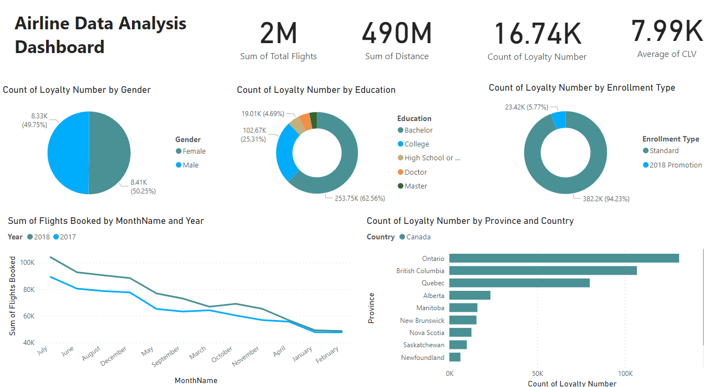

# FlyingWhale Airline BI Case Study: Analyzing customer flight activity and loyalty history to optimize operations and enhance customer experience.

FlyingWhale Airline, a prominent (fictional) international airline, is seeking to enhance its business intelligence capabilities by analyzing Customer Flight Activity and Customer Loyalty History. The airline is committed to optimizing customer experience, understanding travel patterns, and maximizing the effectiveness of its loyalty programs.

## Data

### Customer Flight Activity
- **Loyalty Number**: A unique identifier for each customer's loyalty account.
- **Year and Month**: Period details for analysis.
- **Flights Booked**: Number of flights booked by the member during the period.
- **Flights with Companions**: Number of flights booked with additional passengers.
- **Total Flights**: Combined total of Flights Booked and Flights with Companions.
- **Distance**: Flight distance traveled in kilometers during the period.
- **Points Accumulated**: Loyalty points earned in the period.
- **Points Redeemed**: Loyalty points redeemed during the period.
- **Dollar Cost Points Redeemed**: Dollar equivalent for points redeemed in Canadian Dollars (CDN).

### Customer Loyalty History
- **Loyalty Number**: A unique identifier for each customer's loyalty account.
- **Demographics**: Country, Province, City, Postal Code, Gender, Education, Salary, Marital Status.
- **Loyalty Card**: Current loyalty card status.
- **Customer Lifetime Value (CLV)**: Total invoice value for all flights ever booked by the member.
- **Enrollment Details**: Enrollment Type (Standard / 2018 Promotion), Enrollment Year, Enrollment Month.
- **Cancellation Details**: Cancellation Year and Month if applicable.

## Business Scenarios

### 1. Flight Activity Analysis
- Analyze monthly and yearly flight booking patterns.
- Explore the correlation between flight distances and loyalty points accumulated.
- Assess the impact of companion bookings on loyalty points redeemed.
- Identify the number of companions where members are redeeming the most points.

### 2. Loyalty Segmentation
- Segment customers based on loyalty card status.
- Analyze demographics and behaviors of customers.
- Depict flights booked by loyalty card and broken up by gender.
- Identify trends in Customer Lifetime Value (CLV) across loyalty segments.

### 3. Enrollment and Cancellation Trends
- Analyze reasons and patterns behind membership cancellations.
- Provide information for average duration of enrollment among cancelled members by province.
- Identify most popular months for cancellations.
- Analyze cancellations by education and marital status.
- Identify which loyalty card members have the lowest enrollment duration among cancellations.
- Recommend strategies for improving enrollment and retention.
  

## Deliverables
- Power BI Dashboards and Reports for the scenarios mentioned.
- A comprehensive presentation summarizing key findings and recommendations.

